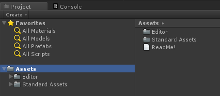
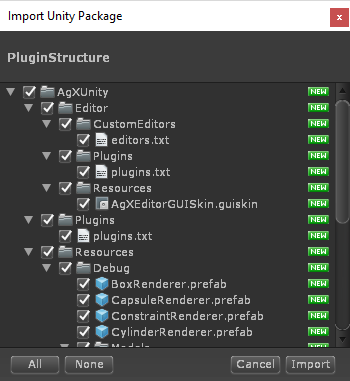
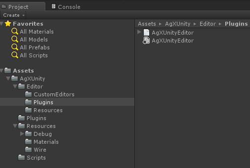

# AGX Unity plugin

The AGX Unity plugin is a set of wrapper, utility and rendering aid classes using the C# API of the AGX Dynamics physics engine. The AGXUnity plugin is a compiled, class library dll.

The AGXUnity plugin is preferably developed in Visual Studio with the latest version of Unity 3D (currently 5.4.1), 64-bit versions of AGX Dynamics and Unity 3D.

## Getting started (Windows)

### Build AgXUnity.dll
1. Download and install Unity 3D: https://unity3d.com/get-unity/download
2. Download and install Visual Studio Tools for Unity: [https://visualstudiogallery.msdn.microsoft.com/8d26236e-4a64-4d64-8486-7df95156aba9](https://visualstudiogallery.msdn.microsoft.com/8d26236e-4a64-4d64-8486-7df95156aba9) 
3. Follow the instructions how to enable debugging in Unity:
[https://msdn.microsoft.com/en-us/library/dn940025.aspx](https://msdn.microsoft.com/en-us/library/dn940025.aspx)
3. Checkout AGXUnity
4.	Open AGXUnity.sln in Visual Studio
5.	Verify all references in the AgXUnity project (Browse for the correct dll files using the Reference Manager)
	
	a.	agxDotNet.dll: *[AgX install path]\bin\x64\agxDotNet.dll*

	b.	UnityEngine.dll: *[Unity 3D install path]\Editor\Data\Managed\UnityEngine.dll*
6.	Build!
7.	The output is **AgXUnity.dll** and **AgXUnityEditor.dll** in the *output* sub-directory

*Required References in visual studio:*

 

The next section describes how to install the folder hierarchy, resources and editor extensions using the pre-exported Unity packages.

### Unity 3D project with AGXUnity
After a successfull build of AGXUnity you should have two new dll-files: AgXUnity.dll and AgXUnityEditor.dll in your output directory.

1.	Make sure AGX binaries and dependencies are in path when starting Unity, e.g.,
a.	cmd -> setup_env.bat -> “<Unity 3D install path>\Editor\Unity.exe” or start the AGX Dynamics Commandline from the start menu.
2.	Open or create a new Unity project. Start Unity3D with for example: <pre>"c:\Program Files\Unity\Editor\Unity.exe"</pre>
3.	The newly created project tab could look something like this:

	

4.	From the AgXUnity\data directory – drag-drop “Data/PluginStructure.unitypackage” into the Assets folder. Make sure everything is marked and press “Import”:
	
	

5. Next copy AgXUnity.dll, agxDotNet.dll and optionally AgXUnity.pdb to the Assets/AgXUnity/Plugins folder.

	**Note:** If the agxDotNet.dll is missing, you’ll get the following exceptions:
 	*System.Reflection.TargetInvocationException: Exception has been thrown by the target of an invocation.
 	Unhandled Exception: System.Reflection.ReflectionTypeLoadException: The classes in the module cannot be loaded.*
 
	**It’s not enough to have the agxDotNet.dll file in path, it has to be in the Plugins folder as well.**
	
	

	Unity and Visual Studio Tools for Unity automatically creates “.meta” and debugging mdb files (if the pdb file is present).

6. Next you have to drop the files AgXUnityEditor.dll and AgXUnityEditor.pdb (for debugging) in the Editor/Plugins folder: 

7. AgXUnity is now ready to use! The menu item AgXUnity contains the objects that can be created using the UI.

	

8. Optional Visual Studio post-build event.
Right click AgXUnity project, select Properties -> Build Events -> “Post-build event command line:” -> “Edit Post-build …” and write:
echo f | xcopy "$(TargetDir)$(TargetName).*" "<path to Unity project>\Assets\AgXUnity\Plugins\" /Y

AgXUnity.dll and AgXUnity.pdb will be copied to the Unity project AgXUnity plugins folder each time you build the project/solution. A similar solution should be done for AgXUnityEditor.dll

It’s currently not possible to copy the agxDotNet.dll each time you build because the dll is not automatically unloaded by Unity.

## AGXUnity.ScriptComponent extends UnityEngine.MonoBehaviour
Since we’re managing native objects and MonoBehaviour in general has a bit undeterministic behavior, all objects handling native objects should inherit from ScriptComponent rather than MonoBehaviour.
There’re also native objects that depends on other native objects. One example of this is constraints. The native constraints has to have native instances to the rigid bodies when the constraints are instantiated. To enable this, ScriptComponent has two important methods. “Initialize” where all native objects should be instantiated and “GetInitialized” which guarantees that the returned component is initialized with a valid native instance.

<pre>
public abstract class ScriptComponent : MonoBehaviour
{
  ...
  /// 

  /// Initialize internal and/or native objects.
  /// 

  /// <returns>true if successfully initialized</returns>
  protected virtual bool Initialize();
  ...
  /// 

  /// Makes sure this component is returned fully initialized, if
  /// e.g., your component depends on native objects in this.
  /// 

  /// <typeparam name="T">Type of this component.</typeparam>
  /// <returns>This component fully initialized, or null if failed.</returns>
  public T GetInitialized<T>() where T : ScriptComponent;
}
</pre>

Example usage – create a (native) lock joint between two game objects containing rigid body components:

<pre>
protected override bool Initialize()
{
  // GetInitializedComponent is an AgXUnity extension to UnityEngine.GameObject.
  // GetInitializedComponent == go.GetComponent<RigidBody>().GetInitialized<RigidBody>().
  AgXUnity.RigidBody rb1 = m_gameObject1.GetInitializedComponent<AgXUnity.RigidBody>();
  AgXUnity.RigidBody rb2 = m_gameObject2.GetInitializedComponent<AgXUnity.RigidBody>();
  if ( rb1 == null || rb2 == null )
    throw new NullReferenceException();

  m_lock = new agx.LockJoint( rb1.Native, rb2.Native );
  GetSimulation().add( m_lock );

  return base.Initialize();
}
</pre>
Each object is guaranteed to only receive one call to “Initialize”. The “Initialize” call is in general called during Unity “Start” phase.
After the “Initialize” call the object receives a “property synchronization” update.
Property synchronization
When data is changed in the editor or when scenes are restored from file (e.g., loading a scene) it’s convenient to handle the data flow in properties rather than fields and update phases. Read more about this in [Propagation of data with AgXUnityEditor.BaseEditor<T>.](#propagation)

As briefly described in previous section, ScriptComponents receives property synchronization update after the object has been initialized. Property synchronization is using reflection to match a private, serialized field to a public property with a matching name.

<pre>
// Private, serialized field.
[SerializeField]
private Vector3 m_myVectorValue = Vector3.zero;
// Public property with matching name to m_myVectorValue.
public Vector3 MyVectorValue
{
  get { return m_myVectorValue; }
  set
  {
    m_myVectorValue = value;
    if ( something != null )
      something.SetValue( m_myVectorValue );
  }
}
</pre>

The name of the property has to be the name of the field but without "m\_" and the first character capitalized. I.e., “MyVectorValue” is a match to “m\_myVectorValue”.
Whenever there’s a match, the property synchronization implementation performs obj.MyVectorValue = obj.m\_myVectorValue, i.e., invoking the “set” method, passing the private field as value.
The main benefit of this property synchronization is to write data to the native instances that were instantiated in the “Initialize” call. Consider the case where one presses “Play” in the editor or when a built application starts:

1. Serialized data is restored from file (to the serialized private and public fields).
2. ScriptComponent objects are initialized (“Initialize” is called) – native objects are created.
3. Property synchronization.

## Extending the Unity 3D editor
The AGXUnity plugin is linked to the native AGX Dynamics physics engine – having the simulated objects in the native environment. When values/properties etc. are changed from within the editor or a script, the data has to be propagated to the native environment – when needed.

The native objects are in general instantiated when Unity performs the “Start” calls. This means that all data has to be stored in the managed environment and then written down to the native environment when the managed object receives the “Start”/initialize call. Since all data is present in the Unity managed environment the serialization is trivial (automatic).

### <a name="propagation"> Propagation of data with AgXUnityEditor.BaseEditor<T></a>
The BaseEditor class is essential for the propagation of data from the managed to the native environment while using the editor. BaseEditor extends UnityEditor.Editor and it’s basically GUI code that you see in the “Inspector” tab in Unity:

Main features of the BaseEditor class is that it can:
- Visualize C# properties.
- Invoke “get” and “set” of C# properties when e.g., a value is changed.
- Invoke methods (when pressing a button).
- Handles custom attributes such as “This value must be larger than 0”.
- Like the default Unity editor class, visualize and change serializable fields.

Using properties instead of serializable fields makes it a lot easier to handle the data flow. Take for example the value of the mass of a rigid body.

<pre>
// Public field, automatically serialized and
// visible in the editor.
public float Mass = 1.0f;
</pre>

Having the mass as a field like this, we have to have at least one more line somewhere in the code where we assign it to the native rigid body instance.
Using properties instead will in general result in more code but enables a solid workflow, minimizing the risk of forgetting to propagate the data and maximizing the understanding when and how the data flows.

<pre>
// Tell Unity we want serialization of this private field.
[SerializeField]
private float m_mass = 1.0f;
public float Mass
{
  get
  {
    return m_mass;
  }
  set
  {
    if ( value <= 0.0f )
      return;

    m_mass = value;

    // Synchronize to native instance if created.
    if ( m_native != null )
      m_native.getMassProperties().setMass( m_mass );
  }
}
</pre>

Since “m\_mass” is private, it won’t be shown in the Inspector tab. Property “Mass” is public so it will be visualized and using BaseEditor the “set” method will be invoked when the value of the mass has been changed. If we have an instance of the native object, we can assign the new value directly.

### How to enable AgXUnityEditor.BaseEditor for an object
For Unity to use a custom editor to render the GUI under the “Inspector” tab, the class implementing the “OnInspectorGUI” method has to carry the attribute “CustomEditor”.
Consider the following, simple class that prints the input value to property “Test”:

<pre>
public class TestComponent : MonoBehaviour
{
  [SerializeField]
  private float m_test = 0.5f;
  public float Test
  {
    get { return m_test; }
    set
    {
      Debug.Log( value );
      m_test = value;
    }
  }
}
</pre>
**Note:** The type constraint is BaseEditor is UnityEngine.Object

Assigning the script to a game object a text field labeled “Text” will appear with value “0.5”. Using the default editor, changing the value, won’t show the debug print.

To enable the BaseEditor functionality, add a new script in any folder named “Editor”, with the following class:

<pre>
using UnityEditor;

[CustomEditor( typeof( TestComponent ) ) ]
class TestComponentEditor : AgXUnityEditor.BaseEditor<TestComponent>
{
}
</pre>
The TestComponent will be rendered the same in the Inspector tab, but when changing the value, the new value will be printed in the Console tab.
