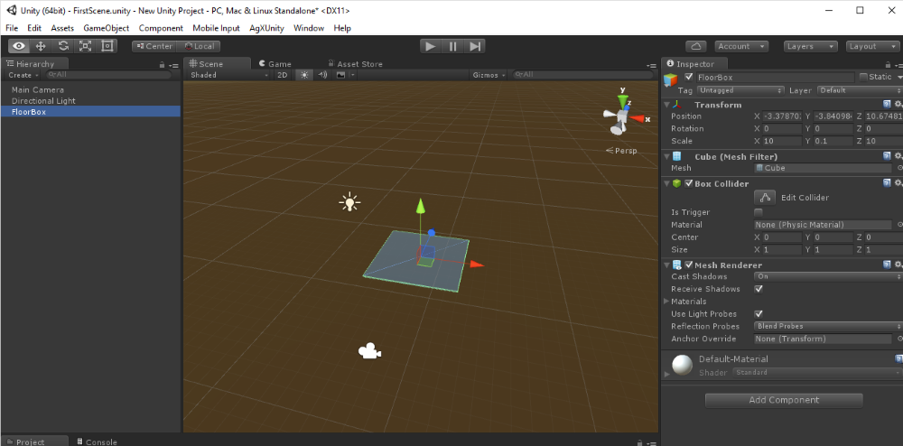
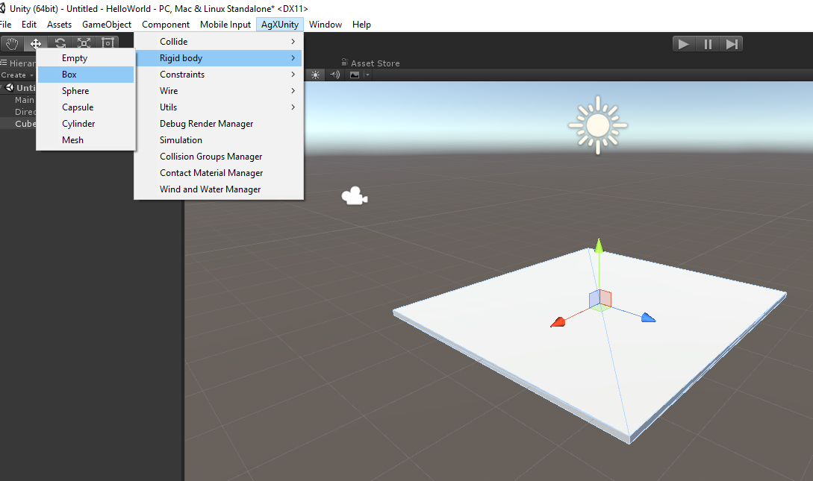
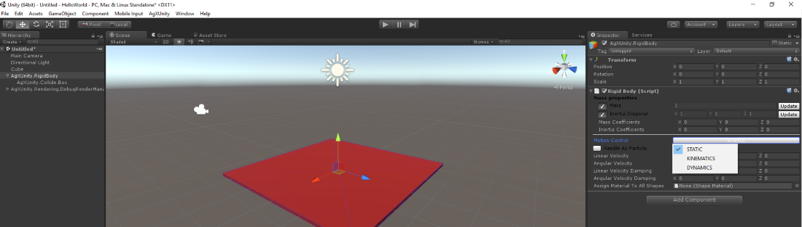

#Tutorial 1: Building your first scene#

##Creating a box##
You can enable the debug rendering so that you can see the AgX Dynamics representation of objects.

**Note:** There is currently a bug which means that the debug rendering (red) of each object will be visible even if the debug rendering component is removed. You need to create a new AgX object to get rid of it.
This will be fixed.

First create a Unity 3D box: to be:

Scale, rotate and place it where you want it:

Second, create an corresponding AgX rigid body:

To allow the visual/Unity representation of the box *move together with the AgX rigid body* you need to move the Unity object into the rigidbody. In this example, the Unity object is named 'FloorBox'

Then you can specify the size of the box (half extents).

**Note:** Do not scale any part of AgX objects. This will lead to invalid simulation results (wrong sizes). You need to specify the actual size of objects. This can certainly be improved in the future.

In this case we enter the size 5,0.05,5 to match the size of the Unity object of 10,0.1,10

If we would now start the simulation, the large box (FloorBox) would just fall in gravity along negative Y axis.
We can make it static (a floor) by specifying the *motion control*:

Next we create yet another (smaller box) and add some image effects for the Camera:

You can also copy/paste the AgX rigid bodies and the visual (Unity) object will follow:

In Game view it will look like this:

**Note:** If a simulation is not created (available in the AgXUnity menu) it will be automatically added when you first start the simulation. You should add a Simulation explicitly if you want to control the time step and gravity.