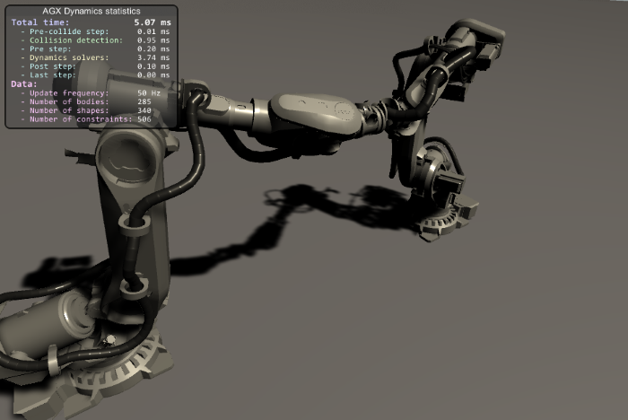
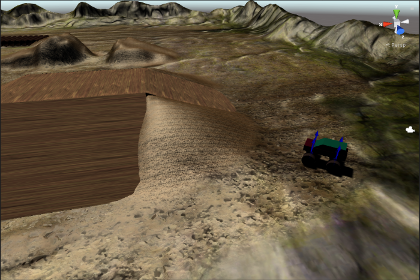

Algoryx Simulation AB 2018

# [AGXUnity reboot](https://github.com/Algoryx/AGXUnity) - agxUnity moved to AGXUnity-deprecated
Due to compatibility issues in Unity when building external class libraries - we've decided to deprecate our first approach (this repository) and restart with a compatible plugin structure where Unity is building all the scripts. The new approach is more future proof and doesn't require a certain IDE to edit scripts and build - simply:

1. cd MyUnityProjects\MyProject\Assets
1. git clone https://github.com/Algoryx/AGXUnity.git
1. copy \<agx-dynamics-install-path\>\bin\x64\agxDotNet.dll AGXUnity\Plugins\x86_64

or

1. Download AGXUnity-x.y.unitypackage
1. Drag and drop into your project assets folder.
1. copy \<agx-dynamics-install-path\>\bin\x64\agxDotNet.dll AGXUnity\Plugins\x86_64

## Migration

Scenes, prefabs and other assets aren't directly compatible with the new version of AGXUnity. As long as the assets has been
serialized as text it's possible to convert them from AGXUnity-deprected to AGXUnity by right clicking any folder or file in
the project tab and select **_Patch AGXUnity asset(s)_**.

Example 1:

1. Create a new Unity project.
1. Clone or install AGXUnity.
1. Copy your previous project files into the new project.
1. Right click `Assets` under the project tab and select **_Patch AGXUnity asset(s)_**.
1. "Yes" to "Search sub-folders for files to patch?".
1. Choose whether to save backups or not.

Example 2:

1. Make sure you have a full backup of your project.
1. Delete the `Assets/AGXUnity` folder (the AGXUnity-deprecated package structure).
1. Checkout or install AGXUnity.
1. Right click `Assets` under the project tab and select **_Patch AGXUnity asset(s)_**.
1. "Yes" to "Search sub-folders for files to patch?".
1. Choose whether to save backups or not.

# [deprecated] AGXUnity
*Unity3D bindings for [AGX Dynamics](http://www.algoryx.se/products/agx-dynamics/)* from [Algoryx Simulation](http://www.algoryx.se).

**Note:** New to AGXUnity? [Checkout or main AGXUnity repository.](https://github.com/Algoryx/AGXUnity)

**Note:** that AGXUnity is an interface/binding to AGX Dynamics, and access the dynamic simulation, requires a binary installation of AGX Dynamics including a valid  license.

AGX Dynamics is a professional *physics engine* which deliver stable, robust and realistic dynamic simulations. AGX is being utilized in hundreds of training simulators and help engineers design and evaluate new mechanical systems in [Dynamics for SpaceClaim](http://www.algoryx.se/products/dynamics-for-spaceclaim/).

With AGXUnity, it is possible to incorporate a *real* physics engine into a well known authoring environment for 3D real time content, Unity3D. 

AGXUnity is still rather in a premature state. It give you a starting point for extending the scripting and gui capabilities to cover larger portion of the vast AGX Dynamics API. We really appreciate if you do git pull request to make this a better binding for everyone using it. 

 
- AGXUnity allows you to utilize AGX Dynamics inside Unity3D.
- Currently it is built and tested with Visual Studio 2015 SP1 and Visual Studio 2017
- The latest package version of AGXUnity requires 2017.1.1
- AGXUnity is free, for more details see: [LICENSE](LICENSE)

## Building AGXUnity
See [Doc/DeveloperGuide.md](Doc/DeveloperGuide.md) for detailed information on how to install/develop and deploy AGXUnity.

For your convenience we have also some pre-built packages which *might* work. 
See the sub-directory **prebuilt-packages** for some sample packages:

Download from the **prebuilt-packages** sub-directory in the repository browser. 

If you use the exact same AGX Dynamics version as well as a matching Unity3D version you might just be able to drag-drop this package into the assets of your project. 

For some reason you need to run two times (and clear the console) before the NullReferenceException: Object reference not set to an instance of an object message disappears.

- **However, we strongly recommend that you check out the code and build from scratch.**

## Sample scenes
In the **Data** subdirectory we have a package named AGXUnityScenes.unitypackage. It contains a few sample scenes which can be used as an inspiration. 

*Notice that you need to accept the AgXUnity.dll while importing the package. If you don't the scenes will probably not work.*

### CableRobot

A scene containing two robots moving synchronously with Cables attached to each robot.

### CarOnTerrain

A car controlled using the keyboard driving over uneven terrain.

## Tutorials
[Creating your first scene tutorial](Doc/tutorial1/tutorial1.md) show you how to create a scene populated with simulated AGX objects.

On YouTube you can find a few video tutorials demonstrating the use of AGXUnity:

- [Modelling with primitives](https://youtu.be/1ddfgIwAd0U)
- [Modelling with materials](https://www.youtube.com/watch?v=bB6d8ZI8bt4)
- [Modelling with constraints](https://www.youtube.com/watch?v=dmlyozKuVlM)
- [Modelling with triangle meshes](https://www.youtube.com/watch?v=L2kRByHcT7g)
- [Modelling with wires](https://www.youtube.com/watch?v=Accpit3LmIA)

## Quick error handling

### agxDotNet.dll missing
If you get this error in the console:

It is because **agxDotNet.dll** cannot be located. Make sure you have it in your project\Assets\Plugins directory.

### agxDotNetRuntime.dll missing

This problem occurs because AGX Dynamics binary files either need to be in the PATH (before starting Unity), or that no AGX Dynamics has been installed to the local computer. If AGX Dynamics is installed, an entry in the windows registry will point out where it has been installed. The NativeHandler.cs will pick this up.

--------------------------------------
> 
> We *really* appreciate feedback. If you have suggestions for improvements, just make a pull request. Together we can make this a great bridge between the awesome graphics of Unity3D and the world class dynamic simulation of AGX Dynamics.

For more information contact Algoryx Simulation: [contact@algoryx.se](mailto:contact@algoryx.se)
