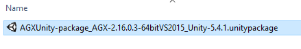

Algoryx Simulation AB 2016

# AGXUnity
*Unity3D bindings for [AGX Dynamics](http://www.algoryx.se/products/agx-dynamics/)* from [Algoryx Simulation](http://www.algoryx.se).

AGX Dynamics is a professional *physics engine* which deliver stable, robust and realistic dynamic simulations. AGX is being utilized in hundreds of training simulators and help engineers design and evaluate new mechanical systems in [Dynamics for SpaceClaim](http://www.algoryx.se/products/dynamics-for-spaceclaim/).

With AGXUnity, it is possible to incorporate a *real* physics engine into a well known authoring environment for 3D real time content, Unity3D. 

AGXUnity is still rather in a premature state. It give you a starting point for extending the scripting and gui capabilities to cover larger portion of the vast AGX Dynamics API. We really appreciate if you do git pull request to make this a better binding for everyone using it. 

 
- AGXUnity allows you to utilize AGX Dynamics inside Unity3D.
- Currently it is built and tested with Visual Studio 2015 SP1.
- The plugin is tested with Unity 5.3.4 and 5.4.1f
- AGXUnity is free, for more details see: [LICENSE](LICENSE)

**Note:** that AGXUnity is an interface/binding to AGX Dynamics, and access the dynamic simulation, requires a binary installation of AgX Dynamics including a valid  license.

##Building AGXUnity
See [Doc/DeveloperGuide.md](Doc/DeveloperGuide.md) for detailed information on how to install/develop and deploy AGXUnity.

For your convenience we have also some pre-built packages which *might* work. 
See the sub-directory **prebuilt-packages** for some sample packages:

Download here: 
[prebuild-packages/AGXUnity-package_2016-09-23-AGX-2.16.0.3-64bitVS2015_Unity-5.4.1.unitypackage](tree/master/prebuild-packages/AGXUnity-package_2016-09-23-AGX-2.16.0.3-64bitVS2015_Unity-5.4.1.unitypackage)

If you use the exact same AGX Dynamics version as well as a matching Unity3D version you might just be able to drag-drop this package into the assets of your project. 

For some reason you need to run two times (and clear the console) before the NullReferenceException: Object reference not set to an instance of an object message disappears.

- **However, we recommend that you check out the code and build from scratch.**
 
##Tutorials
[Creating your first scene tutorial](Doc/tutorial1/tutorial1.md) show you how to create a scene populated with simulated AGX objects.

On YouTube you can find a few video tutorials demonstrating the use of AGXUnity:

- [Modelling with primitives](https://youtu.be/1ddfgIwAd0U)
- [Modelling with materials](https://www.youtube.com/watch?v=bB6d8ZI8bt4)
- [Modelling with constraints](https://www.youtube.com/watch?v=dmlyozKuVlM)
- [Modelling with triangle meshes](https://www.youtube.com/watch?v=L2kRByHcT7g)
- [Modelling with wires](https://www.youtube.com/watch?v=Accpit3LmIA)

##Quick error handling

###agxDotNet.dll missing
If you get this error in the console:

It is because **agxDotNet.dll** cannot be located. Make sure you have it in your project\Assets\Plugins directory.

###agxDotNetRuntime.dll missing

This problem occurs because AGX Dynamics binary files either need to be in the PATH (before starting Unity), or that no AGX Dynamics has been installed to the local computer. If AGX Dynamics is installed, an entry in the windows registry will point out where it has been installed. The NativeHandler.cs will pick this up.

--------------------------------------
> 
> We *really* appreciate feedback. If you have suggestions for improvements, just make a pull request. Together we can make this a great bridge between the awsome graphics of Unity3D and the world class dynamic simulation of AGX Dynamics.

For more information contact Algoryx Simulation: [contact@algoryx.se](mailto:contact@algoryx.se)